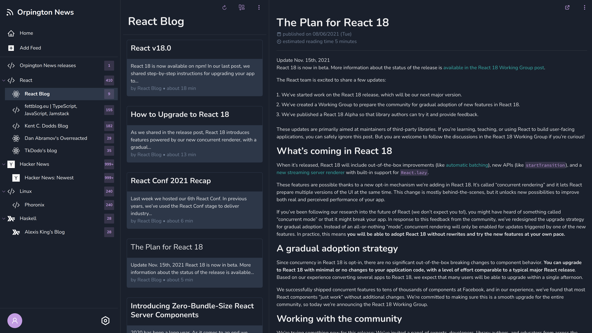

# Orpington News

Orpington News is a self-hosted RSS/Atom feed reader with PWA support.

## Features

- Supports RSS 1.0/RSS 2.0/Atom feeds
- Supports nested collections (groups of feeds)
- Light and dark theme
- Syntax highlighting in code snippets
- Mobile-friendly UI
- PWA support
- RSS feed auto-detection from page URL
- Small Docker image size (< 130 MB uncompressed)

Demo instance is available [here](https://news-demo.orpington.software/).

## Installation

You need two things: Docker and PostgresSQL instance.

Docker image (`ghcr.io/frysztak/orpington-news`) exposes the app on port `8000`. You also need to provide a handful of environmental variables:

- `APP_URL`
- `DB_HOST`
- `DB_PASS`
- `COOKIE_SECRET` - at least 32 characters long random string. You can use `openssl rand -base64 32` to generate it

For `DB_PASS` and `COOKIE_SECRET`, `_FILE` suffix is also supported. For example, `DB_PASS_FILE=./secrets/db_pass` will read database
password from file `secrets/db_pass`. All variables are described in [Wiki page](https://github.com/frysztak/orpington-news/wiki/Env-variables).

Sample `docker-compose.yml` using Traefik is available [here](https://github.com/frysztak/orpington-news/blob/master/docker-compose.yml).

## License

- [GNU GPL v3](http://www.gnu.org/licenses/gpl.html)
- Copyright 2021-2022
